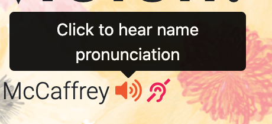

# say-my-name-say-my-name

## Description

A React component (with bootstrap and fontawesome icons) that allows you to add a pronunciation guide to your developer profile. This is especially useful for job-seeking since there is bias against people with non-English names (apparently recruiters can be hesitant to call people if they can't figure out their name pronunciation). This is why I wanted to share this with others. 

This component is complete with tooltips to allow users to easily understand the intention of the feature, and with accessibility in mind (using audible and written pronunciations).

## Table of Contents

* [Installation](#installation)
* [License](#license)
* [Contributing](#contributing)
* [Questions](#questions)

## Installation

- All the `code` required to get started

### Clone

- Clone this repo to your local machine using `https://github.com/a-mccaffrey/say-my-name-say-my-name.git`

### Setup

1. Place the SayMyName folder (inside Components Folder) into your React project's Components folder.

2. Place the Audio folder into your Assets folder (or create an Assets folder).

3. Add your own audio recording of your name to the Audio folder. You may delete the copy of my recording (it's there for your testing ease of use to make sure it's set up properly). **Use an MP3 format.**

4. In the SayMyName.js file, replace the relative path on line 3 to your own MP3 file. Then, replace the const string on line 17 with a URL to a page with your name pronunciation (I recommend using babynames.com).

5. In the SayMyName.css file, replace the colours how you see fit. Change the styling if you'd like, too. The way it's set up is pretty tight, however. I recommend it.

6. Use the SayMyName component as a requirement anywhere else in your app and have fun. Now recruiters won't be scared to call you and pronounce your name incorrectly (we hope).

### What it should look like

## License

This project is under the MIT license. For full license information, please [click here](https://choosealicense.com/licenses/MIT/). 

## Contributing

> To get started...

### Step 1

- **Option 1**
    - 🍴 Fork this repo!

- **Option 2**
    - 👯 Clone this repo to your local machine using `https://github.com/a-mccaffrey/say-my-name-say-my-name.git`

### Step 2

- **HACK AWAY!** 🔨🔨🔨

### Step 3

- 🔃 Create a new pull request using <a href="https://github.com/a-mccaffrey/say-my-name-say-my-name.git/compare/" target="_blank">`hhttps://github.com/a-mccaffrey/say-my-name-say-my-name.git/compare/`</a>.

## Questions

Want to know more? Look me up on GitHub. My username is a-mccaffrey and my profile is [here](https://www.github.com/a-mccaffrey)

Alternatively, get in touch by emailing me at [aisling.s.mccaffrey@gmail.com](mailto:aisling.s.mccaffrey@gmail.com).